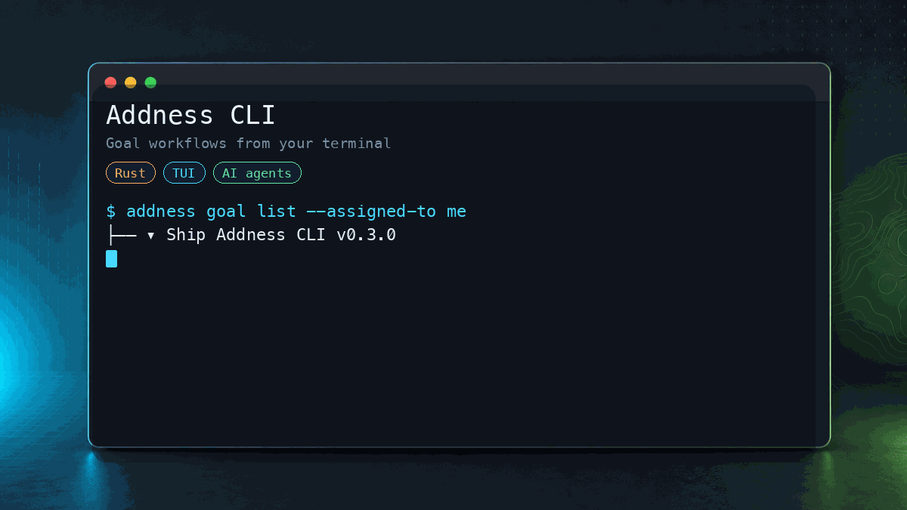

# Addness CLI

<p align="center">
  
</p>

Addness CLI は、ローカルの開発環境・スクリプト・AIコーディングエージェントから Addness を操作するためのターミナルインターフェースです。

コマンドラインから離れることなく、ゴールの確認、進捗の更新、コメントの記入、組織の切り替え、プルリクエストと Addness の紐付けを行えます。

## 主な機能

- ターミナルから Addness のゴールを閲覧・確認する。
- スクリプトやローカルのワークフローからゴールのステータス・進捗を更新する。
- ゴールにコメントを作成する。
- GitHub のプルリクエストを Addness のゴールに紐付ける。
- 組織を切り替える。
- 自動化向けに機械可読な JSON 出力を使う。
- macOS・Linux・Windows 上で単一の Rust バイナリとして動作する。

## インストール

macOS・Linux:

```bash
curl -fsSL https://cli.addness.com/install.sh | sh
```

Windows PowerShell:

```powershell
irm https://cli.addness.com/install.ps1 | iex
```

ソースから:

```bash
git clone https://github.com/AddnessTech/Addness-cli.git
cd Addness-cli
cargo build --release
```

## ログイン

`addness login` を実行し、ブラウザでの認証フローを完了してください。

## 使い方

自分にアサインされたゴールを一覧表示する:

```bash
addness goal list --assigned-to me --status NOT_STARTED
```

スクリプトやエージェント向けに JSON 出力を使う:

```bash
addness goal list --assigned-to me --status NOT_STARTED --json
```

進捗を更新する:

```bash
addness goal update <goal-id> --status IN_PROGRESS
addness goal update <goal-id> --body "現在の状態や次にやること"
addness goal update <goal-id> --due-date 2026-07-01
addness comment create --goal <goal-id> --body "実装を開始しました"
```

プルリクエストを紐付ける:

```bash
addness link pr --goal <goal-id> --url https://github.com/org/repo/pull/42
```

リンク成果物を追加する:

```bash
addness deliverable add --goal <goal-id> --link-url https://example.com --name "参考リンク"
```

コマンドのヘルプを表示する:

```bash
addness --help
addness goal --help
addness org --help
addness comment --help
addness link --help
```

## TUI（ターミナル UI）

サブコマンドなしで起動すると、ゴールツリーを操作できる対話的な TUI が開きます:

```bash
addness
```

主な操作はアプリ内で `?` を押すとヘルプが表示されます。

### TUI 内での codex 連携

ゴール上でアクションメニュー（`o` または `Space`）から **「codexで作業」** を選ぶと、
選択中ゴールの文脈（タイトル・完了基準(DoD)・説明）を渡した状態で
[codex](https://github.com/openai/codex) をペイン内に起動します。
起動直後は軽量コンテキストだけで即入力でき、実依頼を受けた時に必要に応じて
`addness goal get --json --with-deliverable --with-comment` で対象ゴールを読みます。
長い運用ルールはチャット本文ではなく `developer_instructions` に渡します。
codex は Addness をその組織/プロジェクト専用の
作業DBとして読み、DoD や子ゴール分解の不足を確認します。Addness への書き込みは、
サブエージェント・分担・並列作業・別セッションへの引き継ぎが必要な時を基本にします。
codex は Addness を「タスク DB」として扱い、`addness` CLI 経由で DoD の具体化・
子ゴール作成・進捗コメントを書き戻します。
左の Addness ペインには、対象ゴールのステータス、DoD、子ゴール、コメント数、
Addness への更新ログがライブ表示されます。更新ログは `body`、`DoD`、子ゴール、
コメント/通知、成果物など、どの領域が動いたか分かる文言で出ます。
codex の終了時またはペインを閉じる時には、作業フォルダ・ブランチ・git status・
diff stat が対象ゴールの body に自動記録されます。
codex が作業完了を通知したい時は
`addness notification send --kind done --body "実装が完了しました"` を使えます。
確認依頼は `--kind review`、ブロック中は `--kind blocked` です。TUI から起動した
codex では対象ゴール ID が環境変数で渡されるため、`--goal` は省略できます。
通知は Addness には対象ゴールのコメントとして残し、同時に TUI が動いている端末へ
BEL/OSC で送ります。Codex が yes/no や承認判断待ちになった時も端末通知します。

codex 終了後は還流バーのキーで成果を Addness に反映できます:

- `c` … 作業差分をプリフィルした進捗コメントを投稿
- `s` … ゴールのステータスを変更
- `d` … 成果物を登録
- `v` … `codex exec`（read-only）で各 DoD 項目の達成可否を自動判定し、契約ペインにチェック
- 右側の codex 端末上でのトラックパッド/ホイール … codex 本体へスクロールを転送
- `Shift+↑↓` / `Shift+PgUp/PgDn` … 実行中の codex ログをスクロール（`Esc` または `Shift+End` でライブへ戻る）
- `F12` … 実行中の codex を終了して戻る / `Esc`・`q` … ペインを閉じる

前提:

- 各ユーザーの環境に [codex](https://github.com/openai/codex) がインストールされ、ログイン済みであること
  （未インストールの場合はその旨を案内し、TUI はクラッシュしません）。
- 別パスの codex を使う場合は環境変数 `ADDNESS_CODEX_BIN` で実行ファイルを指定できます。
- macOS・Linux で動作します（Windows は擬似端末の挙動が未検証です）。

## 開発

Addness CLI は Rust で書かれています。

```bash
cargo build
cargo run -- --help
cargo fmt --check
cargo clippy -- -D warnings
cargo test
```

## コントリビューション

コントリビューションは GitHub のプルリクエストで歓迎しています。PR を作成する前に、開発環境のセットアップ・レビューの方針・マージのルールについて [CONTRIBUTING.md](CONTRIBUTING.md) を読んでください。

Issue やプルリクエストに、シークレット・ローカル設定・顧客データ・非公開のスクリーンショットを含めないでください。

## セキュリティ

脆弱性は公開の GitHub Issue で報告しないでください。非公開での報告手順については [SECURITY.md](SECURITY.md) を参照してください。

## サポート

再現可能なバグ・機能要望・ドキュメントの問題には GitHub Issues を利用してください。記載すべき内容は [SUPPORT.md](SUPPORT.md) を参照してください。

## ライセンス

Addness CLI は [MIT License](LICENSE) の下で公開されています。

Copyright (c) 2026 Addness.
